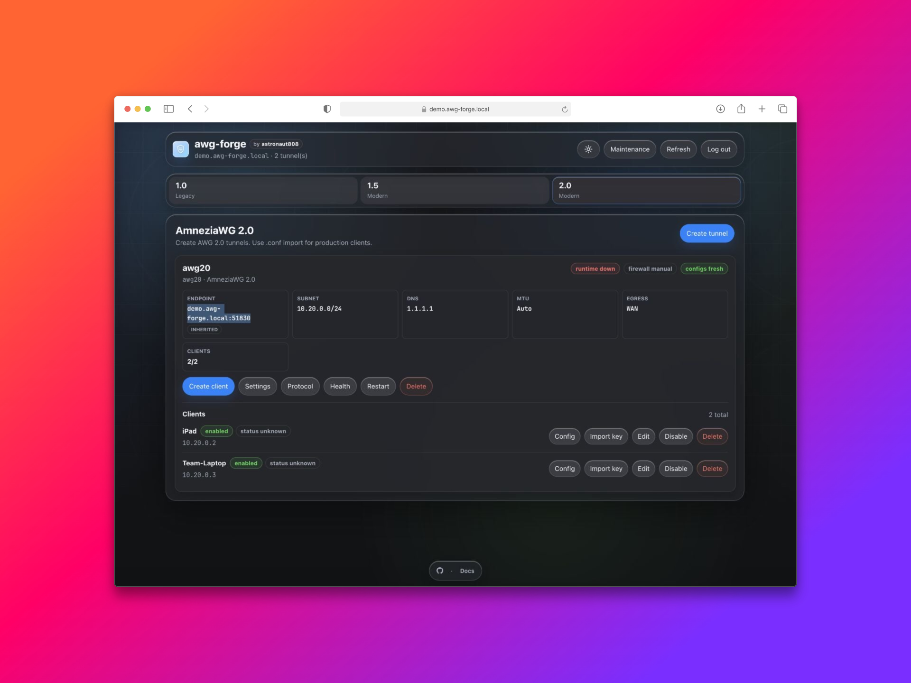

# awg-forge

[README на русском](README.md)

Self-hosted AmneziaWG control panel for Docker: Go backend, static Web UI, and CLI for tunnels, clients, `.conf` files, diagnostics, backup/restore, and safe maintenance.

awg-forge does not implement a custom VPN protocol. It renders AmneziaWG configs and manages the upstream `awg`, `awg-quick`, and `amneziawg-go` tools bundled in the Docker image.



## Supported

- AmneziaWG Legacy / 1.0, 1.5-oriented profile, and 2.0.
- Multiple independent tunnels with separate profiles, ports, and subnets.
- IPv4 egress through `Server WAN` or Cloudflare WARP per tunnel.
- Clients: create, `.conf` download, `vpn://` import key, enable/disable, expiration, delete.
- Runtime diagnostics: Doctor, firewall repair, health, last seen, received/sent counters.
- Maintenance Center: WARP, backup, restore verify, support bundle, audit logs, updates, system info.

The reliable production client import path is the downloaded `.conf`. `vpn://` import key is experimental and depends on AmneziaVPN / DefaultVPN client support. QR import is intentionally not exposed.

## Quick Start

Interactive install on Linux/VPS (Docker required):

```bash
curl -fsSL https://raw.githubusercontent.com/astronaut808/awg-forge/master/install.sh -o install.sh
chmod +x install.sh
sudo ./install.sh
```

The installer creates `/opt/awg-forge`, generates `.env`, password, and `SESSION_SECRET`, detects the external interface, starts Docker Compose, and prints the SSH tunnel command.

By default the Web UI listens on `127.0.0.1:51821`. Open it through an SSH tunnel:

```bash
ssh -L 51821:127.0.0.1:51821 user@server
```

Then open:

```text
http://127.0.0.1:51821
```

## Manual Start

```bash
git clone https://github.com/astronaut808/awg-forge.git
cd awg-forge
cp .env.example .env
mkdir -p data
docker compose up -d
```

Docker host networking is the recommended production mode. It lets tunnels created in the UI use different UDP ports without editing Docker port mappings.

## Important Settings

- `SERVER_HOST` is the default endpoint host for client configs.
- `EXTERNAL_INTERFACE` is the server external interface for WAN egress.
- `WEBUI_HOST=127.0.0.1` is the safe default for SSH tunnel access.
- `APPLY_CONFIG=true` applies runtime tunnels and firewall rules.
- `SESSION_COOKIE_SECURE=auto|true|false` controls the Web UI Secure cookie policy.

`SERVER_HOST` can be overridden per tunnel in `Tunnel settings` -> `Server host`.

WARP can be enabled directly from `Tunnel settings` -> `Egress` -> `Cloudflare WARP`. If WARP is not configured yet, awg-forge registers it automatically. See [Configuration](docs/en/configuration.md).

## Startup Check

1. Create a client in the UI.
2. Import the downloaded `.conf` into AmneziaVPN.
3. Check IPv4 egress:

```bash
curl -4 https://ifconfig.co
```

Doctor:

```bash
docker exec awg-forge awg-forge doctor
```

## Maintenance

Uninstall an installed instance:

```bash
cd /opt/awg-forge
sudo ./uninstall.sh
```

Without cloning the repository:

```bash
curl -fsSL https://raw.githubusercontent.com/astronaut808/awg-forge/master/uninstall.sh | sudo bash
```

Preview the uninstall plan:

```bash
cd /opt/awg-forge
sudo ./uninstall.sh --dry-run --yes
```

Backup/restore, firewall repair, support bundle, logs, and update checks are available from `Maintenance Center` and CLI.

## Documentation

- [Russian README](README.md)
- [Contributing](CONTRIBUTING.md)
- [Security policy](SECURITY.md)
- [English documentation](docs/en/README.md)
- [Quick install](docs/en/quick-install.md)
- [Setup](docs/en/setup.md)
- [Configuration](docs/en/configuration.md)
- [Web UI and CLI](docs/en/usage.md)
- [Diagnostics and troubleshooting](docs/en/diagnostics.md)
- [AmneziaWG updates](docs/en/updates.md)
- [Development](docs/en/development.md)
- [Security](docs/en/security.md)
- [Changelog](CHANGELOG.md)

## Development

```bash
make ci
```

Run locally without applying runtime tunnel changes:

```bash
CONFIG_DIR=/private/tmp/awg-forge-dev \
WEBUI_HOST=127.0.0.1 \
WEBUI_PORT=51821 \
PASSWORD=test \
APPLY_CONFIG=false \
SERVER_HOST=127.0.0.1 \
go run ./cmd/awg-forge serve
```

Runtime and Docker image do not require Node/npm. Deno is used only for linting static JavaScript files in dev/CI.

## License

[MIT](LICENSE)
