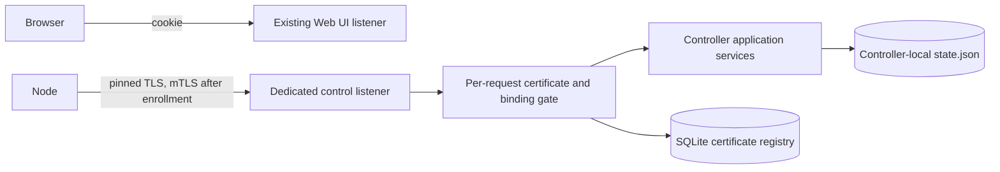

# Control TLS and PKI implementation plan

Status: proposed architecture for delivery sequence phase 5. This is not an
enabled product capability. The phase prepares a dedicated, independently
authenticated node transport; enrollment and fleet features remain later work.

## Current boundary and goal

Controller authentication is implemented. `runServe` currently starts the Web UI
and optional ACME HTTP-01 listener, but no control listener. Controller mode has
an administrator and `controller_id` in `state.json`; it does not have a control
CA or node registry. The `/control/v1` OpenAPI file is a design contract. Current
controller backup creation and restore deliberately reject controller state.

This is a future implementation risk, not a currently reachable controller
TLS/PKI vulnerability: the product has no control listener, enrollment routes,
or issued node certificates. `backup.Create` rejects controller mode, backup
validation rejects controller archives, and restore into an existing controller
fails while creating the required pre-restore backup. The existing multi-file
restore procedure does create a crash-consistency problem **if** controller
backup/restore support is added without a fail-closed recovery gate.

The goal of this phase is a tested control identity, dedicated TLS listener,
certificate issuance and renewal primitives, and a fail-closed authorization
boundary. No ordinary install or upgrade may create a CA, open a control port,
enroll a node, or change Web UI TLS. The first externally reachable control
listener is gated on explicit node-management setup and recoverable controller
backup. Those gates can be completed before node enrollment begins.

## Trust boundaries and ownership

| Boundary | Decision |
| --- | --- |
| Browser `/api` | Keep its existing listener, same-origin cookie session, and current routes. Browser auth never authenticates a node. |
| Node `/control/v1` | Use a separate `net.Listener`, `http.Server`, route table, TLS configuration, and request log policy. Never mount `/api` or static assets there. |
| Enrollment bootstrap | The only future routes allowed without a client certificate are an exact allowlist of invitation claim/status routes. A valid server certificate and pinned controller CA are still mandatory. This phase does not expose these routes. |
| Established node | TLS verifies the client chain and client-auth usage. On **every request**, the application resolves the presented issuer/serial to an active node certificate, `controller_id`, `node_id`, and `binding_epoch` in SQLite. Headers, URL/body IDs, subject CN, and proxy assertions do not establish identity. |
| Controller to node | The node verifies the server hostname/IP SAN using normal TLS verification against its pinned CA, and checks the expected CA public-key pin. Never set `InsecureSkipVerify` or fall back to Web UI/ACME trust. |

Use Go's `tls.VerifyClientCertIfGiven` only because enrollment later needs a TLS
connection without a node certificate. A certificate that *is* presented must
verify. The request gate rejects certificate-free calls outside the exact
bootstrap allowlist. Disable TLS session tickets initially and recheck SQLite
authorization per request anyway, so revocation also affects already open
keep-alive connections. Recheck immediately before committing a future mutating
operation and after a long poll wakes. Database unavailability denies node
requests; it never grants a cached identity or falls back to a browser cookie.

## Persisted identity and lifecycle

- `state.json` remains the authority for whether node management is enabled,
  its bind/advertised endpoint, `controller_id`, and active control identity
  generations. Add an optional controller-control section only after explicit
  setup. Do not overload `ConfigRevision` or use environment variables as the
  durable enable switch.
- Store private CA and server keys under a dedicated `control/` tree inside
  `CONFIG_DIR`: `0700` directories, `0600` regular files, validated parent
  components, no symlinks, atomic writes and directory sync. Use separate
  versioned CA and server-certificate generations so rotation never overwrites
  the last working identity. Public certificates may use the same restrictive
  permissions. Never put a private key in `state.json` or SQLite.
- SQLite stores issued client-certificate metadata and status: unique
  issuer/serial, full certificate fingerprint, public-key fingerprint, node and
  controller IDs, binding epoch, validity, supersession and revocation. It is
  operational authorization data, not the source of tunnel desired state.
  Certificate issuance plus its active record must have an explicit
  transaction/recovery contract; a certificate is not returned until its record
  is durable.
- Create the control CA only during explicit node-management preparation, not
  during controller-auth activation or `serve` startup. On restart, missing,
  malformed, mismatched, or expired committed control identity keeps the control
  listener closed and reports a safe diagnostic. It never generates replacement
  keys. Browser recovery remains available if its separate auth state is valid.
- The initial cryptographic profile is TLS 1.3 with Go standard-library X.509
  and Ed25519 keys. A CA certificate has CA basic constraints and `keyCertSign`;
  server and node leaf certificates have distinct server/client EKUs and no CA
  privilege. Server SANs cover only the configured advertised DNS name or IP.
  Use random unique serials and injected clocks in tests. Proposed lifetimes:
  five years for the CA, 30 days for server and node leaves; renew at two thirds
  of leaf lifetime. These are product policy constants, not user-facing knobs.

### State transitions

1. `absent`: controller auth may be active, but no control identity or port exists.
2. `preparing`: under the application mutation lock, validate controller mode,
   SQLite, endpoint and port separation. Stage
   and sync new identity files. Record a secret-free recovery journal with only
   generation IDs. Do not bind an external socket yet.
3. `prepared`: validate certificate chain, key match, SAN, validity, pin, and
   database schema. Persist the disabled control identity and endpoint in one
   atomic state replacement, then clear the journal. A pre-commit failure
   removes only newly staged files. Restart loads the committed identity
   without starting a listener; it never generates replacement keys.
4. `enabled`: require a newly created and verified encrypted backup of the
   committed identity. A one-use backup receipt is bound to the prepared
   identity generation and administrator session; a restart before enablement
   requires a new backup. Hold the proposed socket open, establish an auth barrier,
   commit the enabled flag, then begin serving. Bind/commit failure leaves the
   listener closed and the prepared identity intact. A post-commit serving
   failure is visible and fail-closed; restart retries the committed identity.
   A control-listener failure does not stop the independent browser listener
   or local tunnel runtime when their own prerequisites remain valid.
   Disabling closes admission, cancels held polls, drains authorized requests
   with a bound, persists disabled state, then closes the socket. It never
   deletes identity or node records.
5. `rotating`: stage and verify a new server leaf, then atomically change the
   active generation. Keep the previous leaf only for a bounded overlap. CA
   rotation is a separate staged trust migration: distribute new trust over
   authenticated channels, confirm adoption, switch serving/issuance, then
   retire old trust. An interruption preserves the old valid path until the
   switch is confirmed. Do not automate CA replacement on expiry or key loss.

Destructive identity reset is a separate root-authorized recovery operation.

The explicit setup action belongs in `internal/app`. A future browser handler
must require a controller session with recent authentication and call that
service. A local root CLI may provide an offline recovery path, but neither
surface may accept private keys in argv or log them. The bind address must be
explicit; do not default to a public wildcard or reuse Web UI/ACME ports.

## Certificate authorization and rotation

The issuer/serial record is a lookup key, not sufficient authorization by
itself. Validate the verified TLS chain, client EKU, validity period, active
issuer generation, exact certificate fingerprint, current node binding and
revocation state at the request boundary. A forged `X-Forwarded-Client-Cert`
(or similar) has no effect. An authenticated certificate authorizes only its
own node's typed control routes.

Renewal requires an active old certificate and a newly signed node-generated
CSR. Verify the CSR signature and accepted key type; never accept or return a
node private key. Write a new certificate record atomically and keep the old
serial active for at most 24 hours to cover the node's atomic key/cert switch.
Explicit revocation or rebind ends that overlap immediately. An expired or
revoked certificate cannot renew itself; local re-enrollment is the recovery
path. Persist node key/cert replacement atomically on the node in phase 6.

Server leaf rotation uses a hot-swappable immutable TLS certificate snapshot;
readers never observe a partial key/cert pair. Changing the advertised hostname
or IP requires a new SAN-bearing server leaf and a controlled endpoint update.
An enabled controller renews its server leaf before the final third of its
lifetime, retains the current valid leaf if renewal fails, and reports a safe
warning before expiry. Expiry closes the control listener rather than serving
an invalid certificate. The CA is never silently replaced. Nodes continue to
pin the same CA unless CA rotation is explicitly staged.

## Exposure and recovery gates

Before a user can enable a non-loopback control listener or enroll the first
node, encrypted controller backup/restore must consistently cover `controller_id`,
the auth SQLite snapshot, `controller-auth.keys`, control CA/server identities,
certificate registry, and later enrollment state. The operator must then
create and verify an encrypted backup containing the newly committed CA before
enabling the listener, and explicitly confirm they saved the downloaded archive
off host. Software can verify archive integrity and generation but cannot prove
that the operator retained an external copy. The current controller-backup
rejection must stay in place until that work is verified. Restore is cold and
explicit; it must not start a second active controller with the same identity.
Missing key files or SQLite fail closed. A restore on a different installation
must preserve the complete controller identity or require explicit new-controller
and node-rebind recovery. For an online backup, hold the application mutation
lock while collecting the immutable key generations and use SQLite `VACUUM INTO`
in a private staging directory for a consistent database snapshot. Encrypt and
verify the combined archive before publishing it; delete incomplete staging on
failure. Authentication session writes may continue because the auth key does
not rotate during the snapshot. Do not copy a live database/WAL pair directly.

The existing restore replaces files one by one and writes `state.json` last.
Before **any** controller restore moves a DB, key, or state file, persist and
directory-sync a root-private, secret-free `restore-pending` marker that the
restore mover explicitly preserves. `runServe` checks this marker before
initializing browser or control authentication and fails closed while it exists.
Only after the restored files, database schema, identities, session/code resets,
and control-disabled state are verified and synced may restore remove the
marker. A failed rollback clears it only after the original files are restored
and verified; otherwise offline root recovery is required. Fault-inject every
rename/sync/crash boundary, including a crash after SQLite replacement but
before `state.json` replacement.

Restoring an older database snapshot can resurrect sessions, used recovery
codes, invitations and revoked node certificates. Phase-5 restore must revoke
restored browser sessions and recovery codes and require offline root
administrator recovery before serving the browser API. It must not open the
control listener until the node-certificate rollback rule is implemented and
verified. Phase-6 restore also invalidates every restored invitation and claim
credential, including those marked pending or consumed in the snapshot. Before
real node enrollment in phase 6, resolve the conflict between
the current ADR's seamless same-identity reconnect goal and fail-closed
revocation after restore. The conservative proposal is to invalidate all
restored node certificates and require explicit local re-enrollment; accepting
old certificates solely because the restored registry says `active` is unsafe.
This is an explicit product decision, not an implicit consequence of backup.

The dedicated listener uses bounded header/body/timeouts, connection and
handshake limits, `Cache-Control: no-store`, generic error bodies, no CORS, and
logs only request ID, safe path template, status and non-secret certificate
metadata. Bootstrap invitation limits are added with the enrollment routes.
Do not log raw URLs, headers, CSRs, request bodies, pins, invitation tokens,
private keys, or certificates containing sensitive identity fields.

## Reviewable implementation slices

These are review checkpoints, not a requirement for separate branches or PRs.
They may be implemented in one feature branch from current `develop`; later
slices depend on earlier ones, and each needs focused tests. No slice changes
the standalone or DB-off default.

| Slice | Main ownership | Deliverable and acceptance evidence |
| --- | --- | --- |
| 0. Contract and failure gates | `docs/design`, `api/control-v1.openapi.json` | Reconcile route security, identity vocabulary, renewal/revocation errors and crash/rotation cases. Add executable tests for the applicable threat/failure rows before enabling runtime routes. |
| 1. Control identity store | `internal/controlpki`, `internal/config`, `internal/storage`, `internal/app` | Generate/load/validate versioned CA and server leaf with safe filesystem rules and secret-free journal. Tests cover interrupted preparation, missing/corrupt keys, symlinks, permissions, wrong SAN/pin and no startup auto-creation. |
| 2. Dedicated TLS runtime | `internal/controlserver`, `cmd/awg-forge`, narrow lifecycle wiring in `internal/server` | Separate server and mux, optional verified client cert at handshake, exact-route authorization gate, bounded resources and graceful shutdown. Real loopback TLS tests cover wrong CA/host, missing/invalid client cert, forwarded-header forgery, revocation on keep-alive and SQLite outage. Production listener remains disabled without explicit setup. |
| 3. Issuance and lifecycle | `internal/controlpki`, `internal/sqldb`, `internal/app` | Signed CSR validation; durable serial registry; renewal overlap, expiry, revocation, rebind fencing and server leaf rotation. Inject clock/failure points; run concurrency/race tests. No public enrollment route yet. |
| 4. Controller backup prerequisite | `internal/backup`, `internal/app`, `internal/sqldb`, docs EN/RU | Consistent encrypted backup/restore of controller identity, auth and PKI; durable pre-restore fail-closed marker, identity-match fencing, cold restore, auth replay reset and canary-secret tests. Inject crashes at every file switch and marker boundary. Restore keeps control closed pending the node-certificate rollback policy. Only after this slice may the explicit non-loopback enable flow be considered. |
| 5. Explicit enablement integration | `internal/app`, `internal/server`, `cmd/awg-forge`, installer tests | Recent-auth protected preparation and enable/disable, endpoint/bind preflight, verified post-preparation backup and reversible runtime transition. No auto-enable on install/upgrade. Do not add claim/approval or fleet UI here; those are phase 6/7. |

For every code slice: targeted Go tests during development, then `make ci`,
`make quality`, `make security-fast`, and `go test -race ./...` for the final
integrated transport. Build the Docker image and run a host-network smoke test
when bind/packaging changes. Before exposure, test a real TLS handshake with
wrong/expired/revoked/overlapping certificates, same-connection revocation,
same issuer/serial with a different certificate fingerprint,
CA-rotation interruption, context cancellation and shutdown, restart with
missing keys/DB, no secret leakage in logs/audit/support bundles, and
standalone/DB-off regressions. Report any unavailable environment gate as
unverified, not passed.

## Decisions to verify in slice 0

- Reserve same-origin `GET /api/controller/control/status`,
  `POST /api/controller/control/prepare`,
  `POST /api/controller/control/enable`, and
  `POST /api/controller/control/disable` for later enablement. The `GET` requires
  a controller session; all mutations require recent authentication. Accept a
  separate bind IP and advertised DNS name or IP plus port;
  reject schemes, paths, userinfo, ambiguous names, wildcard advertised hosts,
  and port collisions. Keep `/api/v1` out of scope.
- Prototype `VACUUM INTO` with the pinned SQLite driver and existing database
  settings; verify snapshot integrity and permissions under concurrent auth
  writes before implementing controller backup.
- Use `(issuer generation, serial)` as the unique certificate key. Store public
  certificate DER and the CSR public-key fingerprint with the issuance row so an
  exact renewal retry can return the original certificate without issuing a
  second one; a different CSR against the same old serial conflicts. Extend the
  draft `/control/v1` renewal contract accordingly.
- Persist CA trust-adoption acknowledgement per enrolled node before retiring
  old trust. An unacknowledged node blocks automatic retirement; a timed-out
  transition stays in an operator-visible staged state. Until phase 6 provides
  authenticated node acknowledgement, CA rotation remains a tested primitive,
  not an automatically enabled fleet operation.
- Settle the restore/revocation trade-off before phase 6: the existing ADR says
  nodes reconnect seamlessly after same-identity restore, while a stale backup
  can undo later certificate revocations. Default to fail-closed re-enrollment
  unless a testable replay-fencing mechanism preserves both properties.

Reference behavior: [Go TLS client-auth and verification](https://pkg.go.dev/crypto/tls),
[Go X.509 issuance and validation](https://pkg.go.dev/crypto/x509), and
[RFC 5280 certificate profile](https://www.rfc-editor.org/rfc/rfc5280).
SQLite documents the [consistent `VACUUM INTO` snapshot](https://www.sqlite.org/lang_vacuum.html).
