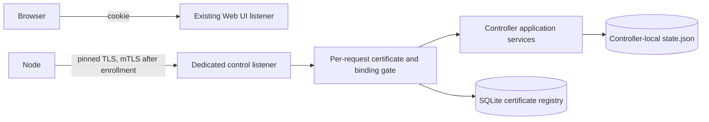

# Control TLS and PKI implementation plan

Status: loopback enrollment, mTLS presence and automatic node certificate renewal
are implemented. External control listeners and fleet operations remain later work.

## Current boundary and goal

Controller authentication, control-identity preparation, certificate registry,
renewal primitives, server-leaf rotation and cold restore fencing are implemented.
The browser API supports explicit recent-auth preparation, a new verified encrypted
backup, confirmation that the archive was retained, and loopback enable/disable.
`serve` restarts only committed enabled control state; `Init` never opens a socket.

A protected invitation file pins the controller CA. The node generates its key
locally and claims one signed CSR; the administrator compares the verification
code before explicitly approving or rejecting it. Only the exact invitation claim
and enrollment status routes permit certificate-free TLS. Initial presence uses
mTLS with a registry check on every request and a persisted boot sequence fence.
The node stores private credentials separately from `state.json`; enrollment
preserves existing local tunnels, and a fresh node has no tunnel. Controller outage,
revocation or certificate expiry stops control admission while local service remains
available. The running node renews after two thirds of its certificate lifetime,
persisting a fresh key and the exact CSR before its first request. A lost response
or restart reuses that CSR; only a complete validated credential generation can
replace the committed generation. No remote tunnel management is exposed.

The `/control/v1` OpenAPI file remains a draft for the wider protocol; claim,
status, presence and certificate renewal are implemented on loopback. Controller
backup includes auth keys, control identity and a verified SQLite snapshot. Cold restore requires the
same existing controller identity and offline admin recovery, disables the listener,
and invalidates restored node authority, invitations, claim credentials and presence.
Node backup includes its committed credential generation and rejects pending
renewal; explicit detach removes controller authority while preserving local
configuration.

The goal of this phase is a tested control identity, dedicated TLS listener,
certificate issuance and renewal primitives, and a fail-closed authorization
boundary. No ordinary install or upgrade may create a CA, open a control port,
enroll a node, or change Web UI TLS. The first externally reachable control
listener is gated on explicit node-management setup, recoverable controller
backup, and an implemented enrollment route. The prerequisites can be completed
and tested on loopback before node enrollment begins.

## Trust boundaries and ownership

| Boundary | Decision |
| --- | --- |
| Browser `/api` | Keep its existing listener, same-origin cookie session, and current routes. Browser auth never authenticates a node. |
| Node `/control/v1` | Use a separate `net.Listener`, `http.Server`, route table, TLS configuration, and request log policy. Never mount `/api` or static assets there. |
| Enrollment bootstrap | Only an exact allowlist of invitation claim/status routes permits requests without a client certificate. A valid server certificate and pinned controller CA are mandatory. These routes are implemented on loopback. |
| Established node | TLS verifies the client chain and client-auth usage. On **every request**, the application resolves the presented issuer/serial to an active node certificate, `controller_id`, `node_id`, and `binding_epoch` in SQLite. Headers, URL/body IDs, subject CN, and proxy assertions do not establish identity. |
| Controller to node | The node verifies the server hostname/IP SAN using normal TLS verification against its pinned CA certificate and checks the SHA-256 fingerprint of that CA's SubjectPublicKeyInfo, encoded as `sha256:` plus 64 lowercase hex characters. The join command and node state use this one pin format. Never set `InsecureSkipVerify` or fall back to Web UI/ACME trust. |

```mermaid
flowchart LR
    Browser -->|cookie| Web[Existing Web UI listener]
    Node -->|pinned TLS, mTLS after enrollment| Control[Dedicated control listener]
    Control --> Gate[Per-request certificate and binding gate]
    Gate --> App[Controller application services]
    Gate --> Registry[(SQLite certificate registry)]
    App --> State[(Controller-local state.json)]
```

Use Go's `tls.VerifyClientCertIfGiven` because enrollment needs a TLS
connection without a node certificate. A certificate that *is* presented must
verify. The request gate rejects certificate-free calls outside the exact
bootstrap allowlist. Disable TLS session tickets initially and recheck SQLite
authorization per request anyway, so revocation also affects already open
keep-alive connections. Recheck immediately before committing a future mutating
operation and after a long poll wakes. Database unavailability denies node
requests; it never grants a cached identity or falls back to a browser cookie.

## Persisted identity and lifecycle

- `state.json` remains the authority for whether node management is enabled,
  its bind/advertised endpoint, `controller_id`, and active control identity
  generations. Add an optional controller-control section only after explicit
  setup. Do not overload `ConfigRevision` or use environment variables as the
  durable enable switch.
- Store private CA and server keys under a dedicated `control/` tree inside
  `CONFIG_DIR`: `0700` directories, `0600` regular files, validated parent
  components, no symlinks, atomic writes and directory sync. Use separate
  versioned CA and server-certificate generations so rotation never overwrites
  the last working identity. Public certificates may use the same restrictive
  permissions. Never put a private key in `state.json` or SQLite.
- SQLite stores issued client-certificate metadata and status: unique
  issuer/serial, full certificate fingerprint, public-key fingerprint, node and
  controller IDs, binding epoch, validity, supersession and revocation. It is
  operational authorization data, not the source of tunnel desired state.
  Certificate issuance plus its active record must have an explicit
  transaction/recovery contract; a certificate is not returned until its record
  is durable.
- Create the control CA only during explicit node-management preparation, not
  during controller-auth activation or `serve` startup. On restart, missing,
  malformed, mismatched or future-valid material, expired CA, and disabled/restored
  controller state keep the control listener closed without replacement identity.
  Narrow startup exception: an intact server leaf of a previously enabled
  controller may renew under its existing valid CA, even after leaf expiry.
  Validate controller ID, metadata, endpoint, key pair, SAN/profile/chain, CA key
  and pin, existing registry/admin/auth material, restore and desired-state fences;
  finish valid journal recovery first. Commit and clean up rotation before bind,
  without changing Enabled or node trust. Any uncertainty keeps control closed.
  Init and offline restore never renew or start control. Browser recovery remains
  available if its separate auth state is valid.
- The initial cryptographic profile is TLS 1.3 with Go standard-library X.509
  and Ed25519 keys. A CA certificate has CA basic constraints and `keyCertSign`;
  server and node leaf certificates have distinct server/client EKUs and no CA
  privilege. Server SANs cover only the configured advertised DNS name or IP.
  Use random unique serials and injected clocks in tests. Proposed lifetimes:
  five years for the CA, 30 days for server and node leaves; renew at two thirds
  of leaf lifetime. These are product policy constants, not user-facing knobs.

### State transitions

1. `absent`: controller auth may be active, but no control identity or port exists.
2. `preparing`: under the application mutation lock, validate controller mode,
   SQLite, endpoint and port separation. Durably record a secret-free recovery
   journal with generation IDs **before** writing new identity files, then stage
   and sync those files. Do not bind an external socket yet.
3. `prepared`: validate certificate chain, key match, SAN, validity, pin, and
   database schema. Persist the disabled control identity and endpoint in one
   atomic state replacement, then clear the journal. A pre-commit failure
   removes only newly staged files. Restart loads the committed identity
   without starting a listener; it never generates replacement keys.
4. `enabled`: after an enrollment route is implemented, require a newly created and verified encrypted backup of the
   committed identity. A one-use backup receipt is bound to the prepared
   identity generation and administrator session; a restart before enablement
   requires a new backup. Hold the proposed socket open, establish an auth barrier,
   commit the enabled flag, then begin serving. Bind/commit failure leaves the
   listener closed and the prepared identity intact. A post-commit serving
   failure is visible and fail-closed; restart retries the committed identity.
   A control-listener failure does not stop the independent browser listener
   or local tunnel runtime when their own prerequisites remain valid.
   Disabling closes admission, cancels held polls, drains authorized requests
   with a bound, persists disabled state, then closes the socket. It never
   deletes identity or node records.
5. `rotating`: stage and verify a new server leaf under the existing CA, then
   durably change only `ServerGeneration`. Close pre-switch connections and
   publish one immutable TLS snapshot; retire the previous leaf immediately,
   with no old-leaf handshake overlap. A secret-free rotation journal fences
   control work until exact cleanup succeeds. CA
   rotation later requires a separate staged trust migration: distribute new
   trust over authenticated channels, confirm adoption, switch serving/issuance,
   then retire old trust. Phase 5 records this contract but does not implement
   fleet CA rotation. Do not automate CA replacement on expiry or key loss.

Destructive identity reset is a separate root-authorized recovery operation.

The explicit setup action belongs in `internal/app`. A future browser handler
must require a controller session with recent authentication and call that
service. A local root CLI may provide an offline recovery path, but neither
surface may accept private keys in argv or log them. The bind address must be
explicit; do not default to a public wildcard or reuse Web UI/ACME ports.

## Certificate authorization and rotation

The issuer/serial record is a lookup key, not sufficient authorization by
itself. Validate the verified TLS chain, client EKU, validity period, active
issuer generation, exact certificate fingerprint, current node binding and
revocation state at the request boundary. A forged `X-Forwarded-Client-Cert`
(or similar) has no effect. An authenticated certificate authorizes only its
own node's typed control routes.

Renewal requires an active old certificate and a newly signed node-generated
CSR. Verify the CSR signature and accepted key type; never accept or return a
node private key. Write a new certificate record atomically and keep the old
serial active for at most 24 hours to cover the node's atomic key/cert switch.
Explicit revocation or rebind ends that overlap immediately. An expired or
revoked certificate cannot renew itself; local re-enrollment is the recovery
path. The node publishes immutable credentials before switching their generation
in `state.json`. The private renewal journal contains fencing metadata only; key
and signed CSR remain in private files. Startup recovers a committed switch even
after certificate expiry, preserving local service. Backup rejects a pending
renewal and contains only the committed credential generation.

Server leaf rotation uses a hot-swappable immutable TLS certificate snapshot;
readers never observe a partial key/cert pair. Changing the advertised hostname
or IP requires a new SAN-bearing server leaf and a controlled endpoint update.
One cancellable worker belongs to each bound application runtime owner. It
renews at NotBefore + (NotAfter - NotBefore) * 2/3, rereads committed authority
after both cancellable locks, and fences stale owners/generations. Retry frequency
is bounded with backoff/jitter and wall-clock rechecks. A CA-capped leaf that
cannot gain validity stays selected until expiry with a safe CA-maintenance
diagnostic; no rotation storm or automatic CA replacement occurs. Journal
publication atomically exposes a complete synced record without replacement.
Pre-commit failure may retain the predecessor; uncertain state save or any
post-commit publication/cleanup failure closes that captured runtime until an
explicit restart. Shutdown closes admission, cancels serving/worker, drains both,
then closes the registry. A drain deadline remains an error even at certificate
expiry. A handler ignoring cancellation keeps its registry alive until it exits;
bounded owner shutdown reports timeout rather than claiming completion. Terminal
renewal closes admission under the generation fence and emits a safe diagnostic.
Expiry closes accepted sockets; old expiry timers
cannot close a successor. Node pin, binding, revocation, sessions, epochs and
ConfigRevision are unchanged by server renewal.

## Exposure and recovery gates

Before a user can enable a non-loopback control listener or enroll the first
node, encrypted controller backup/restore must consistently cover `controller_id`,
the auth SQLite snapshot, `controller-auth.keys`, control CA/server identities,
certificate registry, and later enrollment state. The operator must then
create and verify an encrypted backup containing the newly committed CA before
enabling the listener, and explicitly confirm they saved the downloaded archive
off host. Software can verify archive integrity and generation but cannot prove
that the operator retained an external copy. Controller backup includes auth
keys, exact prepared CA/server generations and a semantically verified registry
snapshot. Restore is cold and
explicit; it must not start a second active controller with the same identity.
Missing key files or SQLite fail closed. A restore on a different installation
must preserve the complete controller identity or require explicit new-controller
and node-rebind recovery. For an online backup, hold the application mutation
lock while collecting the immutable key generations and use SQLite `VACUUM INTO`
in a private staging directory for a consistent database snapshot. Slice 0
must verify the configured database path, snapshot size, and the current
64 MiB in-memory archive limit; an oversized snapshot fails before publication.
Encrypt and verify the combined archive before publishing it; delete incomplete staging on
failure. Authentication session writes may continue because the auth key does
not rotate during the snapshot. Do not copy a live database/WAL pair directly.

The existing restore replaces files one by one and writes `state.json` last.
Before **any** controller restore moves a DB, key, or state file, persist and
directory-sync a root-private, secret-free `restore-pending` marker that the
restore mover explicitly preserves. `runServe` checks this marker before
initializing browser or control authentication and fails closed while it exists.
Only after the restored files, database schema, identities, combined browser/node
reset and control-disabled state are verified and synced may restore remove the
marker. Postconditions are checked from a reopened database. Failures retain
the marker for offline inspection; a final unlink followed by failed directory
sync may leave it absent, but denial is already durable. No automatic resume or
marker-removal command is provided. Fault-inject every
rename/sync/crash boundary, including a crash after SQLite replacement but
before `state.json` replacement.

Restoring an older database snapshot can resurrect sessions, used recovery
codes and revoked node certificates. The implemented internal restore policy
atomically disables the administrator, deletes browser sessions/recovery codes
and revokes every restored certificate and binding, retaining registry history
and existing revocation timestamps. Administrator recovery and repeated stale
restore never reactivate those credentials. Nodes require explicit local
recovery and fresh enrollment; this workflow remains unimplemented. There is
no seamless reconnect or archive-local replay counter. Phase-6 restore must
also invalidate every restored invitation and claim credential when those
capabilities exist.

The dedicated listener uses bounded header/body/timeouts, connection and
handshake limits, `Cache-Control: no-store`, generic error bodies, no CORS, and
logs only request ID, safe path template, status and non-secret certificate
metadata. Bootstrap invitation limits are added with the enrollment routes.
Do not log raw URLs, headers, CSRs, request bodies, pins, invitation tokens,
private keys, or certificates containing sensitive identity fields.

## Reviewable implementation slices

These are review checkpoints, not a requirement for separate branches or PRs.
They may be implemented in one feature branch from current `develop`; later
slices depend on earlier ones, and each needs focused tests. No slice changes
the standalone or DB-off default.

The prepared identity checkpoint in
[control-identity-next-session.md](control-identity-next-session.md) is complete.
The completed registry checkpoint is described in
[control-node-certificate-registry.md](control-node-certificate-registry.md).
The completed renewal handoff is
[control-node-renewal-next-session.md](control-node-renewal-next-session.md).
The internal server-leaf rotation checkpoint is implemented in
[control-server-leaf-rotation-next-session.md](control-server-leaf-rotation-next-session.md).
The application lifecycle owner automatically renews and publishes server leaves
into its loopback runtime; no public rotation route is added. Controller backup/restore
reconciles certificate authority with archived PKI and registry, invalidating
all restored node certificates and bindings. Private loopback enablement has a
one-use, process-local verified-backup receipt bound to the complete prepared
identity and the current recent-auth session. Browser lifecycle wiring requires recent authentication and confirmation that the
new verified backup was retained; control admission is limited to loopback.

| Slice | Main ownership | Deliverable and acceptance evidence |
| --- | --- | --- |
| 0. Contract and failure gates | `docs/design`, `api/control-v1.openapi.json` | Reconcile route security, identity vocabulary, renewal/revocation errors and crash/rotation cases. Add executable tests for the applicable threat/failure rows before enabling runtime routes. |
| 1. Control identity store | `internal/controlpki`, `internal/config`, `internal/storage`, `internal/app` | Generate/load/validate versioned CA and server leaf with safe filesystem rules and secret-free journal. Tests cover interrupted preparation, missing/corrupt keys, symlinks, permissions, wrong SAN/pin and no startup auto-creation. |
| 2. Dedicated TLS runtime | `internal/controlserver`, `cmd/awg-forge`, narrow lifecycle wiring in `internal/server` | Separate server and mux, optional verified client cert at handshake, exact-route authorization gate, bounded resources and graceful shutdown. Real loopback TLS tests cover wrong CA/host, missing/invalid client cert, forwarded-header forgery, revocation on keep-alive and SQLite outage. Production listener remains disabled without explicit setup. |
| 3. Issuance and lifecycle | `internal/controlpki`, `internal/sqldb`, `internal/app` | Signed CSR validation; durable serial registry; renewal overlap, expiry, revocation, rebind fencing and server leaf rotation. Inject clock/failure points; run concurrency/race tests. No public enrollment route yet. |
| 4. Controller backup prerequisite | `internal/backup`, `internal/app`, `internal/sqldb`, docs EN/RU | First make the existing controller identity and auth recoverable, then include PKI generations before any control exposure. Use a durable pre-restore fail-closed marker, identity-match fencing, cold restore, auth replay reset and canary-secret tests. Inject crashes at every file switch and marker boundary. |
| 5. Enablement integration | `internal/app`, `internal/server`, `cmd/awg-forge`, installer tests | Test recent-auth protected preparation, endpoint/bind preflight, verified post-preparation backup and reversible runtime transition on loopback. Keep non-loopback enablement unavailable until phase-6 enrollment routes and their security tests are ready. No auto-enable on install/upgrade. |

The loopback transport implementation is isolated in `internal/controlserver`.
`internal/app` owns the transition; `internal/server` owns startup and shutdown.
`Init` never starts it, even when committed state records `Enabled=true`.
Preparing an identity does not open a socket. The production registry authorizes
presence and renewal; only the two bootstrap routes bypass client-certificate admission.
The runtime uses `GetCertificate` with no fixed fallback certificate. Reload closes
all pre-switch sockets, including unfinished handshakes, and refreshes the
expiry watch without rebinding. An invalid pre-commit candidate leaves the
current snapshot intact; failed publication after state commit permanently
closes that runtime until restart loads the committed generation. It closes
its listener and existing connections when the active CA or server leaf expires;
raw TLS handshake diagnostics are suppressed until safe structured transport
events are defined.

For every code slice: targeted Go tests during development, then `make ci`,
`make quality`, `make security`, and `go test -race ./...` for the final
integrated transport. Build the Docker image and run a host-network smoke test
when bind/packaging changes. Before exposure, test a real TLS handshake with
wrong/expired/revoked/overlapping certificates, same-connection revocation,
same issuer/serial with a different certificate fingerprint,
CA-rotation interruption, context cancellation and shutdown, restart with
missing keys/DB, no secret leakage in logs/audit/support bundles, and
standalone/DB-off regressions. Report any unavailable environment gate as
unverified, not passed.

## Decisions to verify in slice 0

- Reserve same-origin `GET /api/controller/control/status`,
  `POST /api/controller/control/prepare`,
  `POST /api/controller/control/enable`, and
  `POST /api/controller/control/disable` for later enablement. The `GET` requires
  a controller session; all mutations require recent authentication. Accept a
  separate bind IP and advertised DNS name or IP plus port;
  reject schemes, paths, userinfo, ambiguous names, wildcard advertised hosts,
  and port collisions. Keep `/api/v1` out of scope.
- Keep the `VACUUM INTO` controller backup snapshot verified with the pinned
  SQLite driver, including integrity, permissions, size and concurrent auth
  writes. The registry/PKI validation and stale-restore denial tests now cover
  their participation in the archive.
- Use `(issuer generation, serial)` as the unique certificate key. Store public
  certificate DER and a digest of the full CSR DER with the issuance row so an
  exact renewal retry can return the original certificate without issuing a
  second one; a different CSR, including one using the same key, conflicts. Extend the
  draft `/control/v1` renewal contract accordingly.
- Persist CA trust-adoption acknowledgement per enrolled node before retiring
  old trust. An unacknowledged node blocks automatic retirement; a timed-out
  transition stays in an operator-visible staged state. Until phase 6 provides
  authenticated node acknowledgement, CA rotation remains design-only, not an
  automatically enabled fleet operation.
- Preserve the implemented blanket revocation policy across future enrollment
  work. Seamless reconnect would require a separate proven replay fence; a
  generation stored only in the restored archive cannot provide one.

Reference behavior: [Go TLS client-auth and verification](https://pkg.go.dev/crypto/tls),
[Go X.509 issuance and validation](https://pkg.go.dev/crypto/x509), and
[RFC 5280 certificate profile](https://www.rfc-editor.org/rfc/rfc5280).
SQLite documents the [consistent `VACUUM INTO` snapshot](https://www.sqlite.org/lang_vacuum.html).
