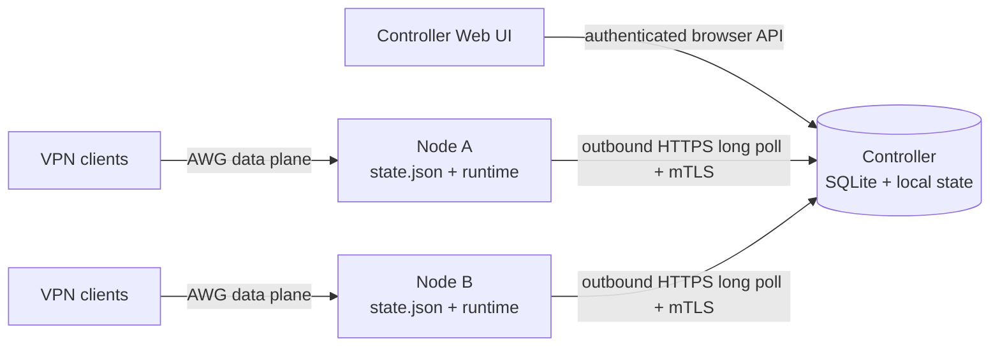

# Multi-node control plane v1

Status: proposed. This document defines implementation constraints; it does not
describe functionality available in the current release.

## Goal

Allow one AWG-Forge controller to manage independent AWG-Forge servers while
preserving node-local tunnel operation and recovery.

The first stable multi-node release must provide:

- guided controller activation and secure node enrollment;
- one controller UI for local and remote nodes;
- node presence, capabilities, redacted status, and diagnostics;
- typed tunnel and client operations with durable idempotency;
- one-time client configuration export without durable secret copies;
- controller backup/restore and explicit node rebind.

## Non-goals

- data-plane routing through the controller;
- automatic tunnel or endpoint failover;
- active-active controllers, quorum, or leader election;
- a shared database replacing node-local `state.json`;
- remote shell, arbitrary command, file, path, or environment execution;
- subscription formats or a second agent image;
- a public operator API in the first multi-node release.

## Architecture decision

Keep one image and one binary with three internal modes:

- `standalone`: current behavior;
- `controller`: manages local state and enrolled remote nodes;
- `node`: retains local data-plane authority and connects outbound to one
  controller.

Routine installation exposes only **Standalone** and **Connect to controller**.
An existing standalone installation enables controller capabilities later in a
guided UI flow. Controller activation and node enrollment are always explicit.

The controller is not in the packet path. Existing tunnels continue forwarding
when the controller, its database, or the control network is unavailable.

## Contract boundaries

Keep three independent HTTP surfaces:

| Surface | Consumer | Authentication | Compatibility |
| --- | --- | --- | --- |
| Existing `/api` | Bundled Web UI | Same-origin session cookie | Preserve current behavior |
| `/control/v1` | AWG-Forge nodes | Pinned server TLS during enrollment, then mTLS | Current and previous control major during rolling upgrades |
| Future `/api/v1` | Operator automation | Scoped opaque tokens | Designed only after the internal model is stable |

The proposed node contract is tracked in
[`api/control-v1.openapi.json`](../../api/control-v1.openapi.json). It is a
design contract, not an enabled listener. Runtime implementation must not begin
until the threat model and failure matrix have executable tests.

Use a dedicated control listener. Browser reverse proxies must not be able to
assert node identity through forwarded certificate headers. Initial enrollment
is the only route that accepts a request without an AWG-Forge node certificate.

## Transport

Nodes initiate bounded HTTPS long polls. This works through ordinary NAT and
common HTTP proxies without opening an inbound management port on a node.

The dedicated listener always uses verified TLS. Controller initialization
creates an internal control CA and a server certificate; the generated join
workflow pins that CA before enrollment. Public ACME or Web UI HTTPS remains an
independent option, so connecting nodes does not require exposing the browser UI
or obtaining a public certificate. Plain HTTP and an `--insecure` fallback are
not supported.

- one outstanding poll per node;
- complete HTTP response on operation delivery or timeout;
- `Cache-Control: no-store` on every control response;
- bounded request bodies, timeouts, concurrency, and queues;
- reconnect with exponential backoff, jitter, and a maximum delay;
- no busy polling and no startup dependency on controller availability.

HTTP/2 streaming may be evaluated after measurements. WebSocket remoting,
gRPC, MQTT/NATS, custom Noise, QUIC, and a management WireGuard tunnel are not
part of v1 because they add operational or protocol complexity without solving
a measured requirement.

## Identity and revision model

Use distinct identifiers for distinct failure domains:

- `node_id`: stable installation identity;
- `state_epoch`: changes after node identity reset, unsafe restore, or clone
  recovery;
- `desired_generation`: monotonic within a state epoch and advances only for a
  committed desired-state mutation;
- `controller_id`: stable identity preserved by encrypted controller backup;
- `binding_epoch`: fences operations from a previous controller binding;
- `boot_id`: random process-start identity used to confirm restart/reconnect.

Existing per-client `ConfigRevision` remains independent. It continues to mean
that a previously exported client configuration may be stale; it must not be
reused as a node-wide desired-state generation.

`state.json` remains the node's desired-configuration source of truth. SQLite
stores controller users, enrollment state, redacted snapshots, queues, leases,
and operational result projections, but never replaces node-local desired
state. A successful mutating-operation receipt belongs in the same atomic
`state.json` commit as the resulting desired state; a SQLite row cannot provide
that cross-store atomicity.

## Desired-state commit boundary

The current application can save state before runtime apply and restore the
previous state after a failure. A generation counter therefore cannot be added
to generic `Store.Save` calls.

Remote mutations require an explicit transaction boundary in `internal/app`:

1. Validate the typed operation, identity epochs, expected generation, and
   capabilities.
2. Build the candidate state without mutating the committed state.
3. Render and validate candidate runtime configuration.
4. Apply the runtime change using existing rollback behavior.
5. Atomically persist the candidate state with the next generation and a
   bounded successful-operation receipt.
6. If final persistence fails, restore the previous runtime and state.
7. Publish success only after the commit point is durable.

Startup reconciliation must detect a crash after runtime apply but before final
state persistence and converge runtime back to persisted desired state. It must
never infer success solely from a running interface.

## Durable operations

Delivery is at least once; execution is idempotent.

- Serialize mutations per node. Read-only reporting may run concurrently.
- Controller assigns immutable operation IDs and deterministic resource IDs.
- Every mutation carries `state_epoch`, `binding_epoch`, and
  `expected_desired_generation`.
- Node records acceptance before execution. For a successful mutation, it
  records the terminal receipt in the same atomic state commit as desired
  state; SQLite may mirror that receipt but is not replay authority.
- Replayed completed operations return the recorded safe result.
- Unsupported or expired operations fail explicitly and never modify state.
- Dangerous operations are not silently queued for an offline node. The user
  must choose **Run when online** and see the expiry.

Operation payloads are discriminated typed schemas. There is no generic command
string or arbitrary JSON execution path. The initial OpenAPI skeleton includes
only a safe snapshot refresh operation; mutation payloads are added with their
application service and failure tests.

Successful mutation receipts are bounded and removed only after durable
controller acknowledgement plus a retention window. Failed operations and
read-only results may live in SQLite because they do not prove a desired-state
transition.

## Enrollment workflow

1. In the controller UI, choose **Add node**, select new or existing install,
   and provide a display name.
2. Controller creates a high-entropy, single-use invitation with a short expiry.
3. UI shows a version-pinned command containing only the controller address,
   pinned CA/SPKI fingerprint, and non-secret invitation ID.
4. The invitation secret is shown separately and entered through a hidden
   interactive prompt. It is never placed in a URL, argv, `.env`, Compose file,
   log, audit event, or support bundle.
5. Node verifies the controller pin, generates its private key locally, and
   submits a CSR plus allowlisted inventory.
6. Terminal and controller UI display the same short comparison code derived
   from the invitation and CSR public key.
7. Administrator approves the pending node. Controller binds the invitation to
   that CSR, issues a short-lived client certificate, and consumes the invite.
8. Node stores the binding and key material with mode `0600`, opens mTLS, and
   reports presence.
9. UI reports success only after the first authenticated presence request.

Fresh managed nodes create no tunnel and keep a loopback break-glass UI.
Existing installations preserve tunnels, clients, Web UI bind/TLS, firewall,
database, and local authentication. Failed enrollment leaves the previous mode
and controller binding unchanged.

The installer orchestrates host and Compose setup, then invokes the same
container enrollment command used for existing installations. It does not
duplicate enrollment logic or retry an incomplete invitation on every startup.

## Compatibility and migration

Multi-node is strictly opt-in. Installing or upgrading AWG-Forge must not enable
controller mode, create control identities, publish the control listener,
replace Web UI authentication, enroll a node, or rewrite tunnel state.

- Controller activation and managed-node enrollment require SQLite and run an
  explicit preflight. Database-off standalone installations remain supported.
- New identity, epoch, generation, and bounded receipt fields are created only
  during successful activation/enrollment in one atomic state migration.
- Existing tunnels, client IDs, `ConfigRevision`, Web UI TLS/bind, local
  password, firewall, and WARP state are preserved.
- The managed upgrade creates and verifies an encrypted backup before any
  multi-node schema migration. Failure restores the previous image and data.
- Upgrade the controller first. It supports current and previous control
  contract majors while nodes are upgraded gradually.
- A node with no mutually supported contract remains locally operational and
  performs no remote mutation.
- Intentional downgrade uses the matching pre-upgrade backup; an older binary
  is not run against a migrated controller database.

Fresh connect-to-controller installs may intentionally start with no tunnel and
unconfirmed network settings. That state is never introduced into an existing
standalone installation by upgrade.

## Controller authentication and recovery

Standalone authentication remains unchanged until controller activation is
complete. Controller administrators use:

- versioned Argon2id password verifiers;
- mandatory TOTP with replay protection;
- revocable server-side opaque sessions;
- one-time hashed recovery codes;
- rate limits per account, verified source IP, and globally;
- local-root recovery for the final break-glass path.

Controller activation prepares and verifies the new authentication state before
one atomic mode switch. After activation, database failure fails closed; it must
not fall back to the old environment password.

Controller recovery is explicit:

- preferred: restore an encrypted backup containing `controller_id`, control
  CA, auth database, registry, and operations, then move the stable endpoint;
- without backup: initialize a new controller and rebind each node locally;
- never: run two controllers with the same restored identity or automatically
  elect a replacement.

## Secret client artifacts

Remote client creation must reuse existing render/export builders on the node.
Private configs, QR payloads, `vpn://` links, private keys, PSKs, and WARP
credentials must not be written to controller operation records, snapshots,
audit logs, or support bundles.

Return a generated artifact over mTLS into a bounded in-memory controller store
with a short TTL and one authenticated browser consumer. Serve it with
`Cache-Control: no-store`. If the controller restarts or the artifact expires,
regenerate it from node-local state instead of persisting a second secret copy.

## Operator experience

- One node switcher shows **This server** and enrolled nodes.
- Reachability, tunnel runtime, client handshake, and Doctor findings remain
  separate states.
- `Online` means the authenticated node poll is current; it does not claim that
  any VPN tunnel works.
- Every remote action shows node, scope, state, expiry, and result.
- Offline operations are explicit and cancellable.
- Controller loss messaging states that existing tunnels continue running.
- Routine UI avoids PKI, epoch, lease, and transport terminology.

## Delivery sequence

1. Track this ADR, the threat model, failure matrix, and `/control/v1` skeleton.
2. Separate desired-state commit semantics from runtime-only persistence.
3. Add dormant node/controller identity and restore fencing.
4. Add controller users, TOTP, recovery, and recent-auth checks.
5. Add dedicated control TLS, internal CA, and certificate lifecycle.
6. Add secure enrollment and installer integration.
7. Add presence, capabilities, redacted snapshots, and read-only fleet UI.
8. Add durable typed operations after crash/idempotency tests pass.
9. Add one-time secret-artifact relay.
10. Stabilize the internal model, then design the external `/api/v1`.

No phase may enable itself during an ordinary upgrade. Each phase preserves
standalone tests and has an explicit rollback path.

## Alternatives considered

- **Inbound node API:** simpler controller calls, but requires public node
  management ports and per-node firewall/TLS setup. Rejected.
- **WebSocket/gRPC stream:** useful for bidirectional low-latency systems, but
  harder to proxy, observe, and recover than the required low-rate command
  channel. Deferred pending measurements.
- **Message broker:** durable queues are attractive, but add another deployed
  security boundary and operational dependency. Rejected for v1.
- **Full SPIRE deployment:** strong workload identity model, but excessive for
  one monolithic product. Borrow single-use enrollment and short-lived identity
  principles instead.
- **Shared configuration database:** creates availability coupling and conflicts
  with node-local recovery. Rejected.

## Release bar

A read-only fleet view is an internal milestone, not a useful stable product by
itself. The first stable multi-node release requires enrollment, core tunnel and
client operations, safe one-time export, controller backup/restore, node rebind,
rolling-version compatibility, and all failure tests in the companion matrix.

## Standards and precedents

- [K3s architecture](https://docs.k3s.io/architecture) and
  [secure token format](https://docs.k3s.io/cli/token) demonstrate outbound
  agent connectivity and CA-bound bootstrap tokens. AWG-Forge borrows the
  pinning principle, not the Kubernetes or remotedialer stack.
- [SPIRE concepts](https://spiffe.io/docs/latest/spire-about/spire-concepts/)
  demonstrate node-local private keys, single-use joining, and short-lived
  issued identities. Deploying SPIRE itself is unnecessary here.
- [Tailscale control and data planes](https://tailscale.com/docs/concepts/control-data-planes)
  support keeping established forwarding independent from controller
  availability; its custom control protocol solves a different problem.
- [RFC 6202](https://www.rfc-editor.org/rfc/rfc6202) defines operational
  constraints for HTTP long polling.
- [OpenAPI 3.1.1](https://spec.openapis.org/oas/v3.1.1.html) models mutual TLS,
  and [RFC 9457](https://www.rfc-editor.org/rfc/rfc9457.html) defines the new
  control API's problem response format.
- [RFC 5280](https://www.rfc-editor.org/rfc/rfc5280),
  [RFC 9106](https://www.rfc-editor.org/rfc/rfc9106), and
  [RFC 6238](https://www.rfc-editor.org/rfc/rfc6238) are the normative bases for
  certificate validation, Argon2, and TOTP respectively.
